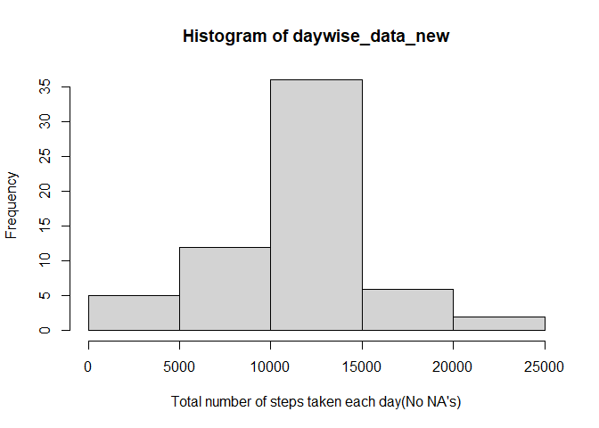

## Loading and preprocessing the data

The first part of the project requires the data to be fetched and processed 


```r
## reading activity data from zipped folder 

File_name <- unzip("activity.zip", list=TRUE)
Activity_Data <- read.table(unz("activity.zip", File_name$Name),header=T, quote="\"", sep=",")
```

##  What is mean total number of steps taken per day?

Includes the required histogram 


```r
daywise_data <- tapply(Activity_Data$steps,as.Date(Activity_Data$date,"%Y-%m-%d"),sum)
hist(daywise_data,xlab = "Total number of steps taken each day")
```

<!-- -->

Also the mean and median calculations day wise 


```r
Act_Data_mean <- tapply(Activity_Data$steps, Activity_Data$date, mean)
Act_Data_med  <- tapply(Activity_Data$steps, Activity_Data$date, median)
```

Value of mean 

```r
print (Act_Data_mean)
```

```
## 2012-10-01 2012-10-02 2012-10-03 2012-10-04 2012-10-05 2012-10-06 2012-10-07 
##         NA  0.4375000 39.4166667 42.0694444 46.1597222 53.5416667 38.2465278 
## 2012-10-08 2012-10-09 2012-10-10 2012-10-11 2012-10-12 2012-10-13 2012-10-14 
##         NA 44.4826389 34.3750000 35.7777778 60.3541667 43.1458333 52.4236111 
## 2012-10-15 2012-10-16 2012-10-17 2012-10-18 2012-10-19 2012-10-20 2012-10-21 
## 35.2048611 52.3750000 46.7083333 34.9166667 41.0729167 36.0937500 30.6284722 
## 2012-10-22 2012-10-23 2012-10-24 2012-10-25 2012-10-26 2012-10-27 2012-10-28 
## 46.7361111 30.9652778 29.0104167  8.6527778 23.5347222 35.1354167 39.7847222 
## 2012-10-29 2012-10-30 2012-10-31 2012-11-01 2012-11-02 2012-11-03 2012-11-04 
## 17.4236111 34.0937500 53.5208333         NA 36.8055556 36.7048611         NA 
## 2012-11-05 2012-11-06 2012-11-07 2012-11-08 2012-11-09 2012-11-10 2012-11-11 
## 36.2465278 28.9375000 44.7326389 11.1770833         NA         NA 43.7777778 
## 2012-11-12 2012-11-13 2012-11-14 2012-11-15 2012-11-16 2012-11-17 2012-11-18 
## 37.3784722 25.4722222         NA  0.1423611 18.8923611 49.7881944 52.4652778 
## 2012-11-19 2012-11-20 2012-11-21 2012-11-22 2012-11-23 2012-11-24 2012-11-25 
## 30.6979167 15.5277778 44.3993056 70.9270833 73.5902778 50.2708333 41.0902778 
## 2012-11-26 2012-11-27 2012-11-28 2012-11-29 2012-11-30 
## 38.7569444 47.3819444 35.3576389 24.4687500         NA
```
value of median 

```r
print (Act_Data_med)
```

```
## 2012-10-01 2012-10-02 2012-10-03 2012-10-04 2012-10-05 2012-10-06 2012-10-07 
##         NA          0          0          0          0          0          0 
## 2012-10-08 2012-10-09 2012-10-10 2012-10-11 2012-10-12 2012-10-13 2012-10-14 
##         NA          0          0          0          0          0          0 
## 2012-10-15 2012-10-16 2012-10-17 2012-10-18 2012-10-19 2012-10-20 2012-10-21 
##          0          0          0          0          0          0          0 
## 2012-10-22 2012-10-23 2012-10-24 2012-10-25 2012-10-26 2012-10-27 2012-10-28 
##          0          0          0          0          0          0          0 
## 2012-10-29 2012-10-30 2012-10-31 2012-11-01 2012-11-02 2012-11-03 2012-11-04 
##          0          0          0         NA          0          0         NA 
## 2012-11-05 2012-11-06 2012-11-07 2012-11-08 2012-11-09 2012-11-10 2012-11-11 
##          0          0          0          0         NA         NA          0 
## 2012-11-12 2012-11-13 2012-11-14 2012-11-15 2012-11-16 2012-11-17 2012-11-18 
##          0          0         NA          0          0          0          0 
## 2012-11-19 2012-11-20 2012-11-21 2012-11-22 2012-11-23 2012-11-24 2012-11-25 
##          0          0          0          0          0          0          0 
## 2012-11-26 2012-11-27 2012-11-28 2012-11-29 2012-11-30 
##          0          0          0          0         NA
```

## What is the average daily activity pattern?


```r
Activity_Data_compl <- subset(Activity_Data,complete.cases(Activity_Data))
mean_steps <- tapply(Activity_Data_compl$steps, Activity_Data_compl$interval, mean)

plot(names(mean_steps),mean_steps,type = "l",xlab = "Interval",ylab = "No of Steps")
```

<!-- -->

Maximum Number of steps 

```r
## 5 min Interval with max steps 
Max_Mean_steps <- mean_steps[mean_steps== max(mean_steps)]
print(Max_Mean_steps)
```

```
##      835 
## 206.1698
```

Drawing the same on the plot i.e the Interval with max value of steps 

```r
Activity_Data_compl <- subset(Activity_Data,complete.cases(Activity_Data))
mean_steps <- tapply(Activity_Data_compl$steps, Activity_Data_compl$interval, mean)

plot(names(mean_steps),mean_steps,type = "l",xlab = "Interval",ylab = "No of Steps")
Max_Mean_steps <- mean_steps[mean_steps== max(mean_steps)]
abline(v=names(Max_Mean_steps),h=Max_Mean_steps,col="Blue")
```

<!-- -->

## Inputing missing values

1.Total Number of missing values in the Dataset 


```r
Activity_Data_compl <- subset(Activity_Data,complete.cases(Activity_Data))
Activity_Data_missing <- subset(Activity_Data,is.na(Activity_Data$steps))
Rows_With_NA <- sum(is.na(Activity_Data))
```


2. Filling NA's and creating a new data set 


```r
##Taking out mean for the complete cases interval wise  wise 
##For the missing cases in the original data set we are replacing them with the 
##mean for the data in the same interval 

Activity_Data_compl_mean  <-tapply(Activity_Data_compl$steps, Activity_Data_compl$interval,mean)

Updated_Activity_Data <- Activity_Data

## creating the new data set with replaced NA's from the original data set.
for (i in 1 : length(Updated_Activity_Data$interval))
{
   if(is.na(Updated_Activity_Data[i,]$steps) ){
     Updated_Activity_Data[i,]$steps <- Activity_Data_compl_mean[names(Activity_Data_compl_mean) ==   Updated_Activity_Data[i,]$interval]
  
   }
 
}
```


3. Histogram for the new data with NA's filled up 


```r
daywise_data_new <- tapply(Updated_Activity_Data$steps,as.Date(Updated_Activity_Data$date,"%Y-%m-%d"),sum)
hist(daywise_data_new,xlab = "Total number of steps taken each day(No NA's)")
```

<!-- -->

4.New Means and Medians with the Updated Data set


```r
Updated_Act_Data_mean <- tapply(Updated_Activity_Data$steps, Updated_Activity_Data$date, mean)
Updated_Act_Data_med  <- tapply(Updated_Activity_Data$steps, Updated_Activity_Data$date, median)

print("Updated mean") 
```

```
## [1] "Updated mean"
```

```r
print(Updated_Act_Data_mean)
```

```
## 2012-10-01 2012-10-02 2012-10-03 2012-10-04 2012-10-05 2012-10-06 2012-10-07 
## 37.3825996  0.4375000 39.4166667 42.0694444 46.1597222 53.5416667 38.2465278 
## 2012-10-08 2012-10-09 2012-10-10 2012-10-11 2012-10-12 2012-10-13 2012-10-14 
## 37.3825996 44.4826389 34.3750000 35.7777778 60.3541667 43.1458333 52.4236111 
## 2012-10-15 2012-10-16 2012-10-17 2012-10-18 2012-10-19 2012-10-20 2012-10-21 
## 35.2048611 52.3750000 46.7083333 34.9166667 41.0729167 36.0937500 30.6284722 
## 2012-10-22 2012-10-23 2012-10-24 2012-10-25 2012-10-26 2012-10-27 2012-10-28 
## 46.7361111 30.9652778 29.0104167  8.6527778 23.5347222 35.1354167 39.7847222 
## 2012-10-29 2012-10-30 2012-10-31 2012-11-01 2012-11-02 2012-11-03 2012-11-04 
## 17.4236111 34.0937500 53.5208333 37.3825996 36.8055556 36.7048611 37.3825996 
## 2012-11-05 2012-11-06 2012-11-07 2012-11-08 2012-11-09 2012-11-10 2012-11-11 
## 36.2465278 28.9375000 44.7326389 11.1770833 37.3825996 37.3825996 43.7777778 
## 2012-11-12 2012-11-13 2012-11-14 2012-11-15 2012-11-16 2012-11-17 2012-11-18 
## 37.3784722 25.4722222 37.3825996  0.1423611 18.8923611 49.7881944 52.4652778 
## 2012-11-19 2012-11-20 2012-11-21 2012-11-22 2012-11-23 2012-11-24 2012-11-25 
## 30.6979167 15.5277778 44.3993056 70.9270833 73.5902778 50.2708333 41.0902778 
## 2012-11-26 2012-11-27 2012-11-28 2012-11-29 2012-11-30 
## 38.7569444 47.3819444 35.3576389 24.4687500 37.3825996
```

```r
print("Updated median")
```

```
## [1] "Updated median"
```

```r
print(Updated_Act_Data_med)
```

```
## 2012-10-01 2012-10-02 2012-10-03 2012-10-04 2012-10-05 2012-10-06 2012-10-07 
##   34.11321    0.00000    0.00000    0.00000    0.00000    0.00000    0.00000 
## 2012-10-08 2012-10-09 2012-10-10 2012-10-11 2012-10-12 2012-10-13 2012-10-14 
##   34.11321    0.00000    0.00000    0.00000    0.00000    0.00000    0.00000 
## 2012-10-15 2012-10-16 2012-10-17 2012-10-18 2012-10-19 2012-10-20 2012-10-21 
##    0.00000    0.00000    0.00000    0.00000    0.00000    0.00000    0.00000 
## 2012-10-22 2012-10-23 2012-10-24 2012-10-25 2012-10-26 2012-10-27 2012-10-28 
##    0.00000    0.00000    0.00000    0.00000    0.00000    0.00000    0.00000 
## 2012-10-29 2012-10-30 2012-10-31 2012-11-01 2012-11-02 2012-11-03 2012-11-04 
##    0.00000    0.00000    0.00000   34.11321    0.00000    0.00000   34.11321 
## 2012-11-05 2012-11-06 2012-11-07 2012-11-08 2012-11-09 2012-11-10 2012-11-11 
##    0.00000    0.00000    0.00000    0.00000   34.11321   34.11321    0.00000 
## 2012-11-12 2012-11-13 2012-11-14 2012-11-15 2012-11-16 2012-11-17 2012-11-18 
##    0.00000    0.00000   34.11321    0.00000    0.00000    0.00000    0.00000 
## 2012-11-19 2012-11-20 2012-11-21 2012-11-22 2012-11-23 2012-11-24 2012-11-25 
##    0.00000    0.00000    0.00000    0.00000    0.00000    0.00000    0.00000 
## 2012-11-26 2012-11-27 2012-11-28 2012-11-29 2012-11-30 
##    0.00000    0.00000    0.00000    0.00000   34.11321
```

## Are there differences in activity patterns between weekdays and weekends?


```r
library(lattice)

## Adding Factor Variables based on days in The data set 


Updated_Activity_Data$day  <- weekdays(as.Date(Updated_Activity_Data$date,format="%Y-%m-%d"))

weekdays1 <- c('Monday', 'Tuesday', 'Wednesday', 'Thursday', 'Friday')
Updated_Activity_Data$day <- factor(Updated_Activity_Data$day %in% weekdays1, levels = c(FALSE, TRUE) ,labels=c('weekend', 'weekday'))

## Calculating mean for the time series plot
Mean_Steps_df<- aggregate(steps ~ interval + day, data = Updated_Activity_Data, mean)

## Making the Plot 

xyplot(steps ~ interval | day, data = Mean_Steps_df, type = "l", lwd = 2,
       layout = c(1, 2), xlab = "interval", ylab = "Number of steps")
```

<!-- -->


This completes the assignment as per requirement.


